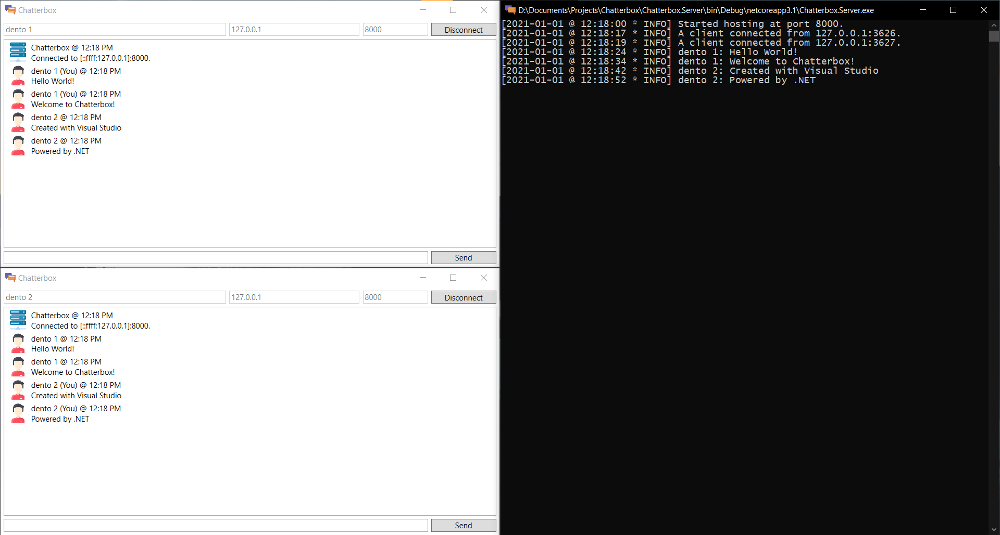

#  Chatterbox

A simple TCP/IP-based chat communication app!

This project was started for me to learn more about [Transmission Control Protocol](https://en.wikipedia.org/wiki/Transmission_Control_Protocol) and how it works using [.NET](https://dotnet.microsoft.com) with the project being a chat app. The project features a server that allows multiple clients up to 4 (as tested so far) to be actively connected and working, and a client featuring a simplistic user interface for easy use and supporting only sending messages with encryption between multiple clients through the server.

## Screenshots

